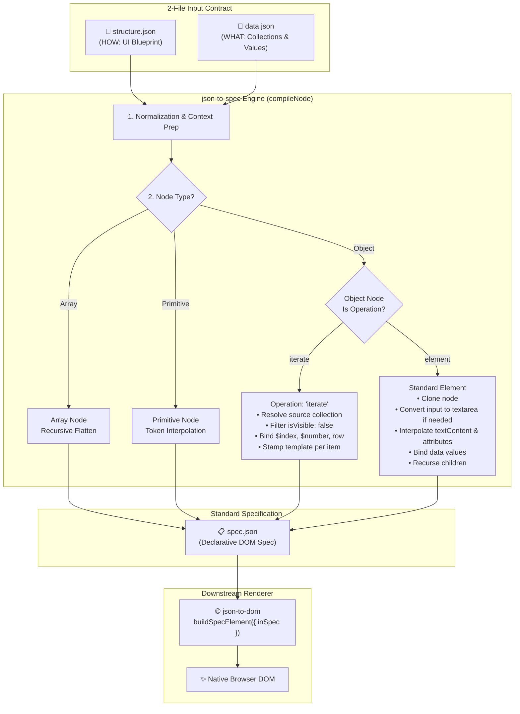

# json-to-spec

<div align="center">

[](package.json)
[](LICENSE)
[](package.json)
[](vite.config.js)
[](https://keshavsoft.github.io/json-to-spec/dist/min.js)

<br>

**Pure JSON Specification Compiler for Declarative UI**  
*Transforms `structure.json` (HOW: UI Blueprint & Operations) + `data.json` (WHAT: Collections & Values) &rarr; Standard Spec JSON ready for `json-to-dom`.*

<br>

[📖 Documentation Hub](https://keshavsoft.github.io/json-to-spec/docs/) &nbsp;|&nbsp; 
[⚡ Live Playground](https://keshavsoft.github.io/json-to-spec/docs/demo.html) &nbsp;|&nbsp; 
[📝 Form Sample](https://keshavsoft.github.io/json-to-spec/docs/samples/form.html) &nbsp;|&nbsp; 
[📊 Table Sample](https://keshavsoft.github.io/json-to-spec/docs/samples/table.html) &nbsp;|&nbsp; 
[🌐 Online CDN Test Suite](https://keshavsoft.github.io/json-to-spec/test/cdn/)

</div>

---

## 📑 Table of Contents

- [💡 What is json-to-spec?](#-what-is-json-to-spec)
- [🎯 Why json-to-spec Exists](#-why-json-to-spec-exists)
- [🚫 What json-to-spec is NOT](#-what-json-to-spec-is-not)
- [⚙️ Runtime Architecture & Compiler Pipeline](#️-runtime-architecture--compiler-pipeline)
- [📦 Installation & Usage](#-installation--usage)
  - [1. NPM Package](#1-npm-package)
  - [2. Zero-Install Online CDN](#2-zero-install-online-cdn)
- [📘 How To: Step-by-Step Guides](#-how-to-step-by-step-guides)
  - [How to Build Dynamic Forms](#how-to-build-dynamic-forms)
  - [How to Build Nested Data Tables](#how-to-build-nested-data-tables)
  - [How to Use Token Interpolation](#how-to-use-token-interpolation)
  - [How to Filter Collections](#how-to-filter-collections)
- [🛠️ Build System (Vite)](#️-build-system-vite)
- [🧪 Online CDN Testing Suite](#-online-cdn-testing-suite)
- [📖 Detailed Documentation Topics](#-detailed-documentation-topics)
- [📂 Repository Structure](#-repository-structure)
- [🤝 Downstream Integration: json-to-dom](#-downstream-integration-json-to-dom)
- [📄 License](#-license)

---

## 💡 What is json-to-spec?

`json-to-spec` is a **pure, deterministic specification compiler** for data-driven declarative user interfaces. 

It takes strictly **two input files** and produces **one standard output**:

```
[structure.json] (HOW: Blueprint & Operations)
       +
  [data.json]    (WHAT: Collections & Values)
       │
       ▼
   json-to-spec (compile)
       │
       ▼
   [spec.json]   (Standard Spec ready for json-to-dom)
```

### The 2-File Contract

1. **`structure.json`** (`inStructure`): **HOW** to display.
   - Declarative HTML hierarchy (`tagName`, `attributes`, `children`).
   - Declarative node-level iteration points (`"operation": "iterate"`, `"source": "<key>"`).
   - Layout blueprints, CSS utility classes (Tailwind, Bootstrap), and structural shells.

2. **`data.json`** (`inData`): **WHAT** to display.
   - Single source of truth for collections (`columns`, `rows`, `options`).
   - Column metadata (titles, field keys, visibility flags).
   - Concrete business values and calculated summary totals.

### Key Characteristics

- **Pure Functional Transform**: Given the exact same `structure.json` and `data.json`, `compile()` produces the exact same `spec.json` with no side effects.
- **Zero Dependencies**: Zero external packages or runtime polyfills.
- **Environment Agnostic**: Runs in browsers, Node.js, Web Workers, Cloudflare Workers, and serverless edge functions.
- **Sub-Millisecond Speed**: Compiles typical form and table specs in **0.1ms to 0.4ms**.

---

## 🎯 Why json-to-spec Exists

### The Problem It Solves

In modern data-driven applications (ERP systems, dynamic inventory grids, voucher builders, administrative backoffices), backend databases and API endpoints already express data and metadata as **JSON payloads**.

However, turning dynamic JSON into UI has traditionally suffered from three flawed approaches:

| Approach | Major Flaws |
| :--- | :--- |
| **String Templates**<br>*(Handlebars, Mustache, template strings)* | Brittle syntax, poor escaping, high XSS risk with `innerHTML`, complex helper registration for basic nested loops. |
| **Heavy Frameworks**<br>*(React, Vue, Angular)* | Heavy runtime bundle overhead, complex build toolchains (Webpack, Rollup, Babel), and tight coupling between raw schema data and framework component lifecycles. |
| **Multi-File Orchestrators** | Dividing layouts across instructions, templates, schema bindings, and event maps causes **synchronization drift**. Modifying a single column forces edits across 4 different files. |

### The Solution

`json-to-spec` eliminates multi-file synchronization drift by consolidating the entire pipeline into **two files**:
1. You design the layout blueprint once (`structure.json`).
2. You pass whatever data payload the backend or API delivers (`data.json`).
3. `json-to-spec` marries the two, resolves tokens, expands iterations, and emits standard spec JSON.

---

## 🚫 What json-to-spec is NOT

To maintain absolute focus, high speed, and zero dependencies, `json-to-spec` enforces clear boundaries:

1. **NOT a DOM Renderer**: It does **not** call `document.createElement`, modify DOM nodes, or attach event listeners. It operates strictly in JSON space. Rendering is handed off to [`json-to-dom`](https://github.com/keshavsoft/json-to-dom).
2. **NOT a Virtual DOM Framework**: There is no Virtual DOM tree diffing, no state signals, and no component lifecycle hooks. When data changes, re-running `compile()` takes `< 0.5ms`.
3. **NOT a CSS Framework**: It is completely style-agnostic. You can use Tailwind CSS, Bootstrap, vanilla CSS, or custom design tokens.
4. **NOT an Imperative Code Evaluator**: It does **not** use `eval()` or `new Function()`. Operations and token interpolations are declarative and safe for strict Content Security Policy (CSP) environments.

---

## ⚙️ Runtime Architecture & Compiler Pipeline

The compilation pipeline operates as a deterministic, recursive tree traversal:



### Compiler Pipeline Stages

1. **Entry Normalization**: Standardizes inputs using the `in`-`local` parameter convention (`inStructure`, `inData`).
2. **Recursive Traversal**: Depth-first traversal over objects, arrays, and primitive tokens.
3. **Operation Detection**: Detects `operation: "iterate"` or `$iterate`.
4. **Collection Resolution & Filtering**: Resolves the target array using `resolvePath`, evaluates custom filters, and drops records where `isVisible === false` (e.g. primary keys).
5. **Context Stamping & Row Binding**: For each collection item, binds `$index` (0-based), `$number` (1-based), item metadata, and parent `row` cell values.
6. **Token Interpolation**: Resolves `${field}`, `${value}`, `${title}`, and deep dot-paths (`${summary.totalItems}`).
7. **Control Type Transformation**: Automatically transforms `<input>` to `<textarea>` when column metadata specifies `type: "textarea"`.
8. **Specification Emission**: Emits clean, valid JSON specification ready for `json-to-dom`.

---

## 📦 Installation & Usage

### 1. NPM Package

```bash
npm install json-to-spec
```

Exposed via `main: index.js` and `module: ./src/v1/index.js`:

```javascript
import { compile } from "json-to-spec";

const spec = compile({
    inStructure: structureObject,
    inData: dataObject
});
```

### 2. Zero-Install Online CDN

Use directly in any modern browser without bundlers or npm dependencies:

```html
<div id="app"></div>

<script type="module">
    // 1. Import compiler & DOM engine via CDN
    import { compile } from "https://keshavsoft.github.io/json-to-spec/dist/v1/min.js";
    import { buildSpecElement } from "https://keshavsoft.github.io/json-to-dom/dist/v16/min.js";

    // 2. Blueprint & Data
    const structure = {
        tagName: "div",
        attributes: { class: "card p-4 shadow-sm" },
        children: [
            { tagName: "h3", textContent: "User List" },
            {
                operation: "iterate",
                source: "users",
                template: {
                    tagName: "div",
                    textContent: "${$number}. ${name} (${role})",
                    attributes: { class: "py-1 text-slate-700" }
                }
            }
        ]
    };

    const data = {
        users: [
            { name: "Karthik", role: "Architect" },
            { name: "Praveen", role: "Engineer" }
        ]
    };

    // 3. Compile spec & render live DOM
    const spec = compile({ inStructure: structure, inData: data });
    const domNode = buildSpecElement({ inSpec: spec });
    document.getElementById("app").appendChild(domNode);
</script>
```

---

## 📘 How To: Step-by-Step Guides

### How to Build Dynamic Forms

Dynamic forms define a form shell with a repeat point iterating over columns:

**`structure.json`**:
```json
{
  "tagName": "form",
  "attributes": { "class": "p-4 bg-white rounded-xl shadow-sm max-w-xl mx-auto" },
  "children": [
    {
      "operation": "iterate",
      "source": "columns",
      "filter": { "isVisible": true },
      "template": {
        "tagName": "div",
        "attributes": { "class": "mb-3" },
        "children": [
          { "tagName": "label", "textContent": "${title}", "attributes": { "class": "form-label fw-semibold" } },
          { "tagName": "input", "attributes": { "type": "text", "name": "${field}", "class": "form-control" } }
        ]
      }
    },
    {
      "tagName": "button",
      "textContent": "Save Record",
      "attributes": { "type": "submit", "class": "btn btn-primary" }
    }
  ]
}
```

**`data.json`**:
```json
{
  "columns": [
    { "title": "Category", "field": "Category", "isVisible": true },
    { "title": "Item Name", "field": "ItemName", "isVisible": true },
    { "title": "Rate", "field": "Rate", "isVisible": true },
    { "title": "Primary Key", "field": "pk", "isVisible": false }
  ],
  "Category": "Beverages",
  "ItemName": "Green Tea",
  "Rate": 150
}
```

---

### How to Build Nested Data Tables

Tables demonstrate nested iterations: `thead` iterates over columns, `tbody` iterates over rows &times; columns, and `tfoot` binds summary aggregations:

```json
{
  "tagName": "table",
  "attributes": { "class": "table table-striped" },
  "children": [
    {
      "tagName": "thead",
      "children": [
        {
          "tagName": "tr",
          "children": [
            { "tagName": "th", "textContent": "#" },
            {
              "operation": "iterate",
              "source": "columns",
              "filter": { "isVisible": true },
              "template": { "tagName": "th", "textContent": "${title}" }
            }
          ]
        }
      ]
    },
    {
      "tagName": "tbody",
      "children": [
        {
          "operation": "iterate",
          "source": "rows",
          "template": {
            "tagName": "tr",
            "children": [
              { "tagName": "td", "textContent": "${$number}" },
              {
                "operation": "iterate",
                "source": "columns",
                "filter": { "isVisible": true },
                "template": { "tagName": "td", "textContent": "${value}" }
              }
            ]
          }
        }
      ]
    },
    {
      "tagName": "tfoot",
      "children": [
        {
          "tagName": "tr",
          "children": [
            {
              "tagName": "td",
              "textContent": "Total Records: ${summary.totalItems}",
              "attributes": { "colspan": "5" }
            }
          ]
        }
      ]
    }
  ]
}
```

---

### How to Use Token Interpolation

Tokens inside `textContent` and any `attributes` property are automatically resolved:

| Token | Scope | Description | Example |
| :--- | :--- | :--- | :--- |
| `${field}` | Item Context | Field or property name | `"ItemName"` |
| `${title}` | Item Context | Column label or display title | `"Item Name"` |
| `${value}` | Cell Context | Cell value bound from current row | `150` |
| `${$index}` | Loop Context | 0-based iteration index | `0, 1, 2...` |
| `${$number}` | Loop Context | 1-based iteration counter | `1, 2, 3...` |
| `${row.field}` | Nested Context | Access parent row property | `row.Category` |
| `${summary.total}` | Root Context | Deep dot-delimited path from root | `summary.avgRate` |

---

### How to Filter Collections

Use the `filter` object to restrict which elements are rendered:

```json
{
  "operation": "iterate",
  "source": "columns",
  "filter": {
    "isVisible": true
  },
  "template": { ... }
}
```

> **Automatic Filtering Rule**: Any record containing `"isVisible": false` is automatically excluded by default (e.g. hidden primary key `pk` fields).

---

## 🛠️ Build System (Vite)

`json-to-spec` uses **Vite** to compile the library into minified ES bundles hosted directly by GitHub Pages as a CDN:

```bash
# Start local Vite development server
npm run dev

# Compile latest src/vN into docs/dist/vN/min.js & docs/dist/min.js
npm run build
```

The build output is structured as:
- `docs/dist/v1/min.js` — Versioned bundle for immutable reference
- `docs/dist/min.js` — Automatically copied latest bundle

---

## 🧪 Online CDN Testing Suite

Want to test `json-to-spec` in the browser without spinning up a local server or installing dependencies? Use our pre-built standalone CDN test pages:

| Workbench | Description | CDN Link |
| :--- | :--- | :--- |
| **CDN Testing Hub** | Dashboard for all online CDN tests | [Launch Hub](https://keshavsoft.github.io/json-to-spec/test/cdn/index.html) |
| **Form CDN Test** | Column loop, value binding, hidden fields | [Run Form Test](https://keshavsoft.github.io/json-to-spec/test/cdn/form.html) |
| **Table CDN Test** | thead/tbody nested iterations & summary | [Run Table Test](https://keshavsoft.github.io/json-to-spec/test/cdn/table.html) |
| **Documentation Portal** | Live documentation & architectural guides | [Open Docs](https://keshavsoft.github.io/json-to-spec/docs/) |
| **Interactive Playground** | Live browser playground with dual JSON editors | [Open Playground](https://keshavsoft.github.io/json-to-spec/docs/demo.html) |

---

## 📖 Detailed Documentation Topics

Explore dedicated guides in `docs/`:

- [📘 What is json-to-spec?](https://keshavsoft.github.io/json-to-spec/docs/pages/what.html) &bull; [Markdown](docs/markdown/what.md)
- [🎯 Why this compiler exists](https://keshavsoft.github.io/json-to-spec/docs/pages/why.html) &bull; [Markdown](docs/markdown/why.md)
- [🚫 What json-to-spec is NOT](https://keshavsoft.github.io/json-to-spec/docs/pages/what-not.html) &bull; [Markdown](docs/markdown/what-not.md)
- [⚙️ Runtime Architecture & Pipeline](https://keshavsoft.github.io/json-to-spec/docs/pages/architecture.html) &bull; [Markdown](docs/markdown/architecture.md)
- [📝 Step-by-Step Tutorial](https://keshavsoft.github.io/json-to-spec/docs/pages/how-it-works.html) &bull; [Markdown](docs/markdown/how-it-works.md)

---

## 📂 Repository Structure

```
json-to-spec/
├── docs/                             # GitHub Pages Documentation & CDN host
│   ├── dist/                         # Vite build output (CDN)
│   │   ├── min.js                    # Latest bundled ES module
│   │   └── v1/min.js                 # v1 bundled ES module
│   ├── demo.html                     # Live interactive browser playground
│   ├── index.html                    # Documentation homepage
│   ├── markdown/                     # In-depth architectural markdown docs
│   │   ├── what.md                   # What is json-to-spec
│   │   ├── why.md                    # Why json-to-spec exists
│   │   ├── what-not.md               # What json-to-spec is NOT
│   │   ├── architecture.md           # Runtime architecture & compiler pipeline
│   │   └── how-it-works.md           # Step-by-step tutorial
│   ├── pages/                        # HTML versions of architectural guides
│   │   ├── what.html
│   │   ├── why.html
│   │   ├── what-not.html
│   │   ├── architecture.html
│   │   └── how-it-works.html
│   └── samples/                      # Standalone CDN sample pages
│       ├── index.html                # Samples hub
│       ├── form.html                 # Form CDN sample
│       └── table.html                # Table CDN sample
├── samples/
│   ├── form/                         # Sample form structure & data JSON
│   └── table/                        # Sample table structure & data JSON
├── src/
│   ├── index.js                      # Root export
│   └── v1/                           # Version 1 engine
│       ├── index.js                  # Engine entry point
│       └── instructionEngine/
│           ├── compileTree.js        # Universal recursive compiler
│           └── resolvePath.js        # Safe token & path resolver
├── test/
│   ├── index.html                    # Local test dashboard
│   ├── cdn/                          # Standalone online CDN test pages
│   │   ├── index.html                # CDN test hub
│   │   ├── form.html                 # CDN Form test
│   │   └── table.html                # CDN Table test
│   ├── form/                         # Local Form workbench
│   └── table/                        # Local Table workbench
├── index.html                        # Repository home & demo launcher
├── index.js                          # Root module entry point for npm
├── package.json                      # npm package configuration
├── vite.config.js                    # Vite library build configuration
└── README.md
```

---

## 🤝 Downstream Integration: `json-to-dom`

`json-to-spec` outputs pure spec JSON. Render this spec directly as browser DOM elements with [`json-to-dom`](https://github.com/keshavsoft/json-to-dom):

```javascript
import { compile } from "https://keshavsoft.github.io/json-to-spec/dist/v1/min.js";
import { buildSpecElement } from "https://keshavsoft.github.io/json-to-dom/dist/v16/min.js";

const spec = compile({ inStructure, inData });
const domNode = buildSpecElement({ inSpec: spec });
document.getElementById("app").appendChild(domNode);
```

---

## 📄 License

MIT &copy; [KeshavSoft](https://github.com/KeshavSoft)
